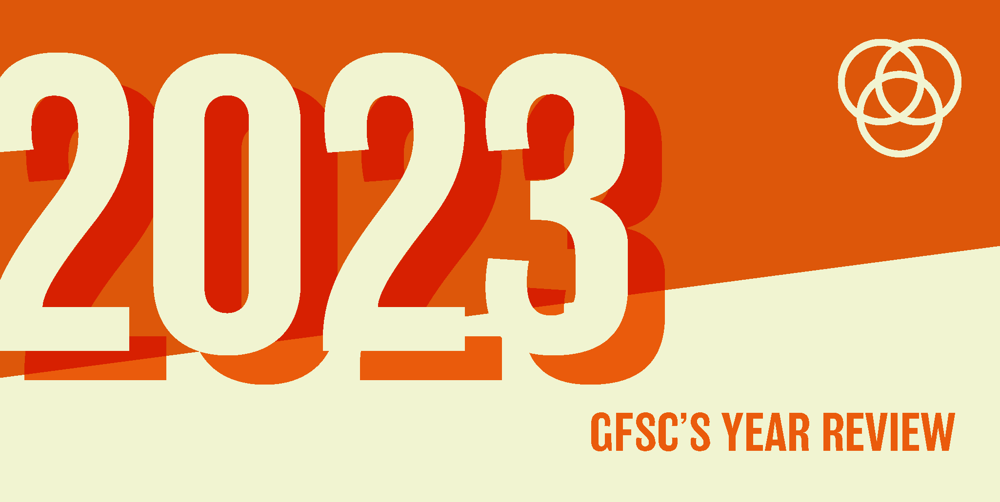

We thought we’d wrap up 2023 by running through a slightly self-indulgent roundup of everything we’ve been up to as a studio this year. It’s been a long tiring year, and we’ve done *loads* of stuff, much of which hasn’t quite yet come to fruition – so we haven’t been able to make a lot of noise about it. Consider this blog a little celebration for us, and a teaser of lots of exciting stuff to come in 2024!

## We launched Trans Safety Network’s website and rebrand

We were delighted to launch a [beautiful new website and brand identity](https://transsafety.network) for Trans Safety Network, designed in partnership with our longtime collaborator Mark, aka [Studio Squid](https://studiosquid.co.uk/). By completing a rebrand, we aimed to shore up their trustworthiness as an organisation. 

Later on in the year, Trans Safety Network were asked to give evidence to Victor Madrigal, the UN Independent expert on sexual orientation and gender identity in London, along with a bunch of other trans folks doing research in similar areas. As a result of this, Madrigal launched a condemnation of the UK government’s attacks on trans people. This was a really big win for TSN as an organisation and we are proud to have been part of their growth this year. 

## We hired some new people

We welcomed three new team members this year, both to expand our technical development capacities, and to enable us to better manage the other functions of the studio, like client liaison, copy, bid writing, day to day management, and more (turns out, running a studio is a big job, who knew?) We have grown together as a team and are continuing to learn and develop our collaborative approach as a studio.

## We developed our own website to reflect our growth as a studio

It feels a bit meta to talk about our website on our website, but here it is! We did a lot of work to improve [gfsc.studio](http://gfsc.studio) this year, starting with an [improved portfolio section](https://gfsc.studio/our-work/), which better enables prospective collaborators to actually explore and understand the work we’ve done. We’ve also improved our blog pages, and have developed our processes to actually expand our blogging capacity and share more of our ideas via social media. 

We also [added a section to highlight our publications](https://gfsc.studio/our-work/publications/), and [teamed up with Pen Fight distro](https://penfightdistro.com/book-author/gfsc/) to get some of our physical artefacts out into the world, including zines on accessibility, state violence in Manchester and more in the works. 

## We continued to develop our flagship project, PlaceCal

This year we’ve put in a load of work on [PlaceCal](https://gfsc.studio/project/placecal/). Ultimately, we hope that PlaceCal comes to represent a ‘log off, go hang out with your friends in your neighbourhood’ attitude and infrastructure. The software offers a really simple way for community organisations to list who they are and what they do. Over the last few years, we have been setting up the necessary community development network around this, and particularly this year, have been growing our capacity and ability to help community groups address their own tech needs, with support.

We recognised one major missing piece in the system, which was the ability to foster communities of interest as well as communities of place. We added a category system to PlaceCal to address this. Now we can add extra partnerships — for example, if you have 10 friends who all run music nights or knitting clubs or cycling groups, we’re making a system where all of you can make your own listings on a shared site that connects in with whatever existing scheduling/calendar software you’re using. This represents a powerful way for communities to take back ownership of their event data, while still equipping them with the tools to promote what they’re doing. 

PlaceCal aims to go back to an earlier sort of web — it doesn’t take all your data, it just gives you the information you need. By this time next year, we really hope we’ll be seeing the fruits of our labour, with way more groups signed up and active and the system really starting to show its power. 

## We continued our research and practice around Community Technology Partnerships

At its heart, the work we've been doing on PlaceCal is framed around the idea of Community Technology Partnerships’. So many people say things like “I’m not a tech person”, yet they spend 8 hours a day on a computer. They feel this way because big tech has disempowered people – you can’t really make changes to how Google Drive or Facebook work. This inability to make changes (or even meaningfully express the desire for changes) makes people feel like they can’t possibly achieve what they need with the tech they have. 

The CTP approach recognises that not everyone needs to be the tech equivalent of a brain surgeon, or a rocket scientist or whatever. CTPs aim both to foster connections on a human, community scale with those who ARE tech rocket scientists/brain surgeons, to empower those who aren’t and have no interest in being. 

Tech is so often framed as a tool for making things that make money (the newest app, or service, or tool) but we want to reframe it as a thing that actually tangibly helps you and money doesn’t come into it. If you want help promoting an event, organising a meal share or setting up a tool loan hub, Community Technology Partnerships would allow you to access the knowledge in your neighbourhood to make it happen.

You hear stories about face to face services provided by councils or other authorities being cancelled or substantially reduced, and replaced with a poor website. This is a prime example of technology failing to work in service of community needs and taking a problem which should be solved in the real world into a tech space. We want to use tech to bring problems back to being solved in a hands on, real world way. 

We’re a little over a year into the CTP project — and we want to reconfigure the way tech is talked about. Tech is a world that everyone’s in. We want to ask – who is it increasing capabilities for? and who is it removing capabilities from? In the new year, we plan to really push these ideas out there. 

## We developed the Nextdoor Nature hub for the Wildlife Trusts

We were absolutely thrilled to work on a major project with the Wildlife Trusts to research and develop how technology should play a part in their major Nextdoor Nature initiative. They want to see 1 in 4 people across the UK taking action for nature and they gave us the task of researching and developing a digital tool or service to facilitate this. 

We did a lot of research to help them figure out what they needed, which ultimately led to the launch of the beta [Nextdoor Nature hub](https://nextdoornaturehub.org.uk). This site aims to consolidate all the amazing resource creation and community networking work that the individual trusts are doing into one place where everyone can benefit from it. One of the biggest findings of our research across the wildlife trusts was that a lot of their work was being duplicated, and also that both staff and the public often struggled to find what they need. It was clear that they needed to develop both a space and a system to better collaborate and collate all of their incredible resources and stories.

This beta site still needs more visual and functional development, but it is in testing now and we hope that the Wildlife Trusts will soon incorporate a version of it into their main site. 

## We launched The Towers, a community history project based in Oldham

We were delighted to launch [The Towers: A history of Summervale and Crossbank](https://towersoldham.uk), after a long collaboration with First Choice Homes Oldham to research and understand the stories and history of two iconic (now demolished) tower blocks, often referred to as ‘the gateway to Oldham’. 

The Towers aims to commemorate these two tower blocks, by collecting histories and memories from the area. Telling the stories of areas like this is vital, as they can often be left undocumented and forgotten. Understanding the past of an area can play a big part in brightening its future – so, in partnership with FCHO and MA student Sam Benbow, we undertook a large body of on-the-ground research to try and find as many former residents as possible.

The project was not without its challenges, and we talked about these in detail across our [series](https://gfsc.studio/blog/2022/rafft-design-blog/) [of](https://gfsc.studio/blog/2023/raftt-design-blog-2/) [three](https://gfsc.studio/blog/2023/raftt-design-diary-3/) design diary blogs.

There was also a lot of digital exclusion in the area and a big part of the project was aiming to explore this alongside the people who live there – enabling people to both tell their stories and foster the digital skills that would help them in doing so. This was much harder in practice than in theory, but we are very proud of the final site, and the huge amount of work that went in behind the scenes. 

As part of this project, we also developed [some resources which aim to help other community groups understand Creative Commons](https://gfsc.notion.site/A-guide-to-Creative-Commons-and-image-citation-for-Community-and-Local-Heritage-projects-94728686f3684805bd81345d8a2cfc57) and other rights issues with relation to heritage projects. This is often a vital part of funded bids, and so we were proud to be able to deliver this guide in addition to the main project.

## We got our Patchwork Gardens concept moving

Patchwork Gardens is an idea we’ve had in the works for a long time. Everyone is familiar with seeing small, underutilised patches of land in their neighbourhood. Abandoned planters, grotty strips of grass, glass strewn verges. Who maintains them? How could I grow on them? Patchwork Gardens aims to start this conversation, and offer pathways to activate this land. 

This idea is extremely popular, but getting the funding to meaningfully progress it has been a real challenge. We’ve been extremely fortunate to work with a small amount of funding and support from Friends of the Earth this year. This has enabled us to put together a sophisticated pitch deck (and accompanying body of research) to better approach larger funders and progress the project further, which is what we are endeavouring to do over the coming months.

With the climate crisis and food shortages, we think this work is vital. In the course of our research we have spoken to gardeners, activists, charities, technologists, academics and more — all of whom are united around the same ideas. We need to grow more. We need to grow locally. We need to provide more of our own food. Gardening fosters community and strength and we need to remove the barriers that currently exist so that more people can be a part of this movement. 

## We worked on a full rebrand and new website for Gendered Intelligence, the UK’s largest trans charity

It has been such a privilege to work on a full rebrand and website for GI, the UK’s largest trans charity. Taking on the website for such a vital charity as this was no small task, and we really wanted to make sure we did the most we possibly could to support the staff and volunteers at GI as well as the people who use their services. 

We reorganised a lot of their information architecture, and did a thorough content audit of their huge amount of resources, in order to make everything more clearly findable. Previously, their website was organised by the departments of their organisation, which often ends up happening with charities and other orgs — it makes sense internally, but not necessarily to those trying to access their services. So, we turned everything upside down, shook it all out, did loads of research and restructured the site around those who will be accessing it.

It’s one of the biggest jobs we’ve ever done as a studio, and we can’t wait for the site to fully launch in the new year! As always it’s been a pleasure to work with our frequent collaborator Mark at [Studio Squid](https://studiosquid.co.uk/), who has developed an absolutely gorgeous new brand identity for GI as a whole. Its first application will be in their new website and subsequently rolled out across all of their materials.

## We launched the Trans Organisers Fund

Finally, we’ve launched the Trans Organisers Fund to support trans organising infrastructure in Greater Manchester. There is a more formal announcement to come soon – but basically, we’ve been given a grant by Lankelly Chase to directly support trans-led and trans-involving organising in Greater Manchester!  

The trans scene can be a stressful one — there’s no compensation, tensions can run high and in a marginalised group that’s suffering some of the most targeted harassment in memory, it’s hard work to keep organising in such a climate.

This fund will be super targeted — going straight to those who are doing trans organising work on the ground in Manchester. We’ve given out grants to the first few groups, plan to give out more, and if it’s a success we’ll see how we can expand it (source more funds and figure out a long term plan).

There will be more information and a mini site to come in the new year which will explain more about the fund, but we are so proud to have had the opportunity to get this off the ground this year and wanted to share this as the last point in our 2023 round up!

Thanks so much for supporting us in our work this year. If you'd like to do more to help out around here, you can [donate to our Ko-fi](https://ko-fi.com/gfscstudio) or [sign up to our Discord](https://discord.gfsc.studio) to keep in touch. We have a wonderful community who enable us to keep doing what we're doing. 

Happy holidays and happy new year from everyone at Geeks for Social Change! 