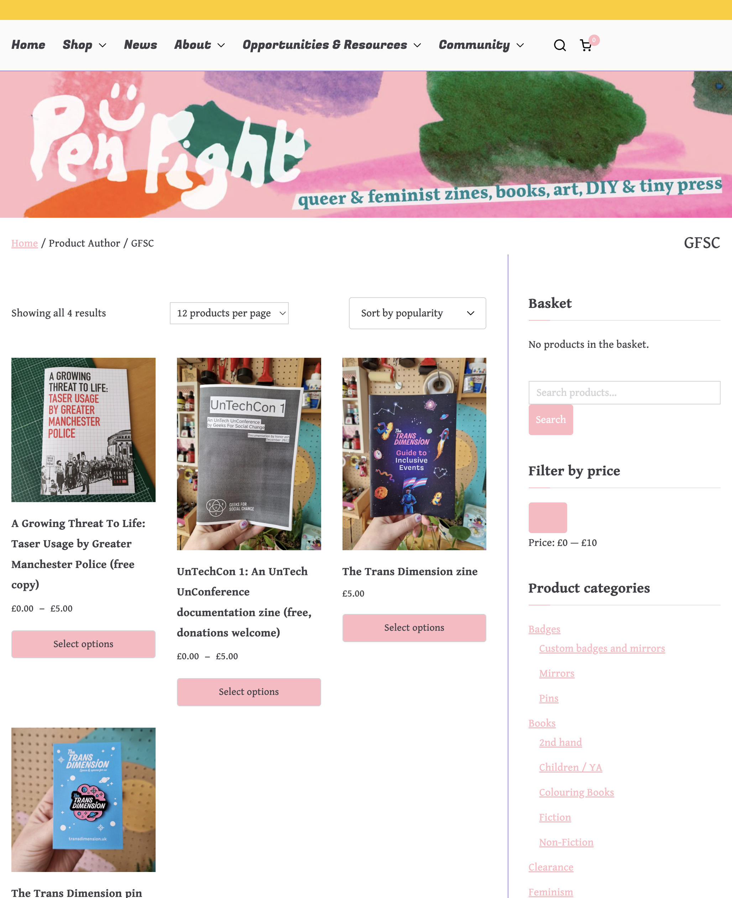
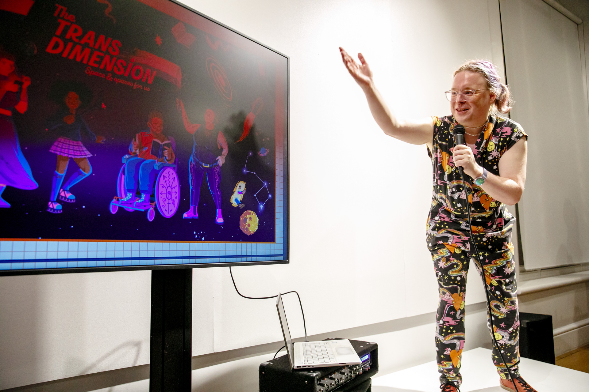
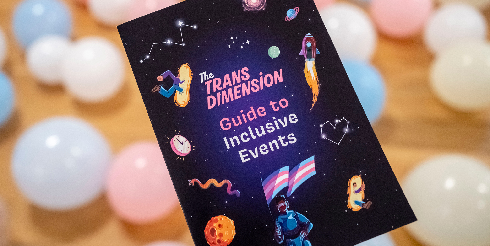
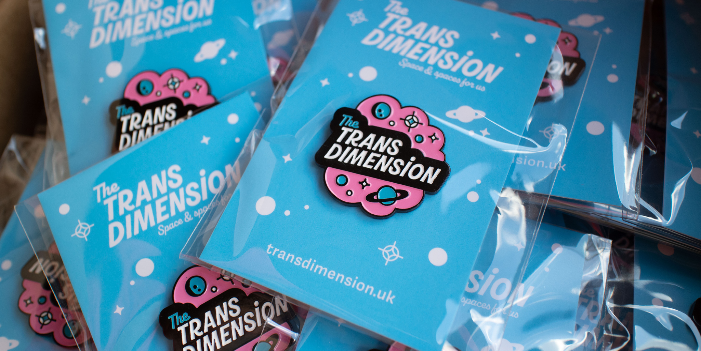
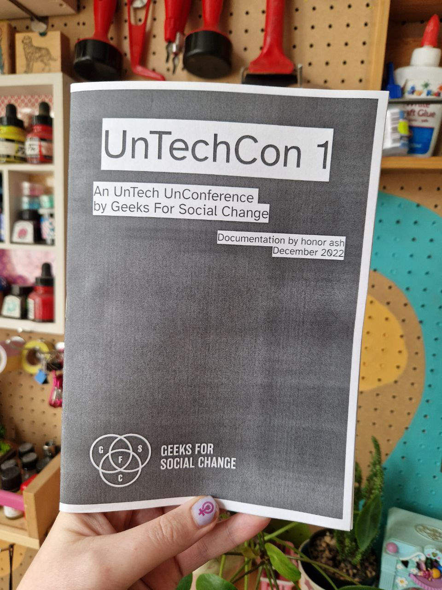
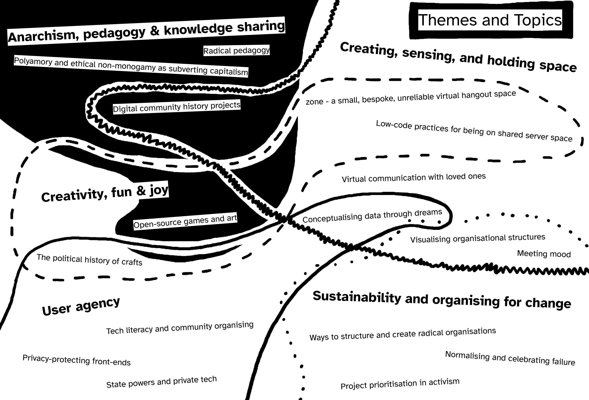
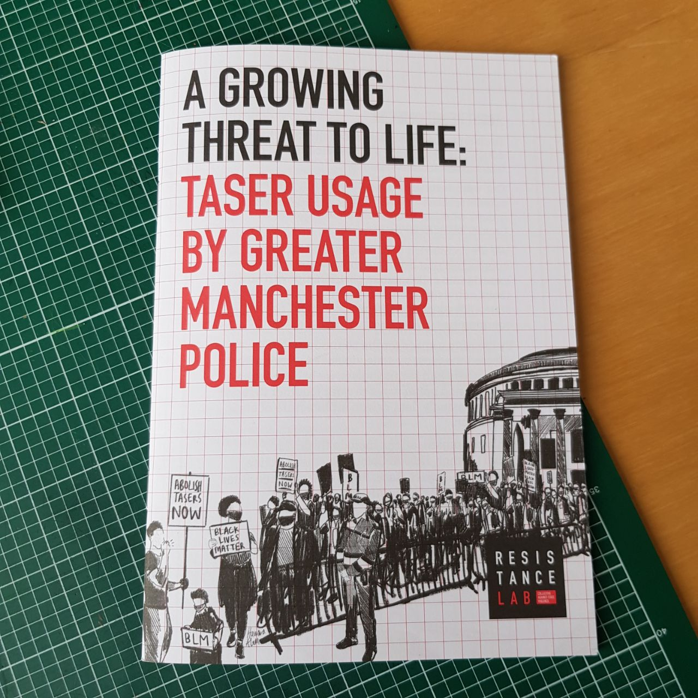
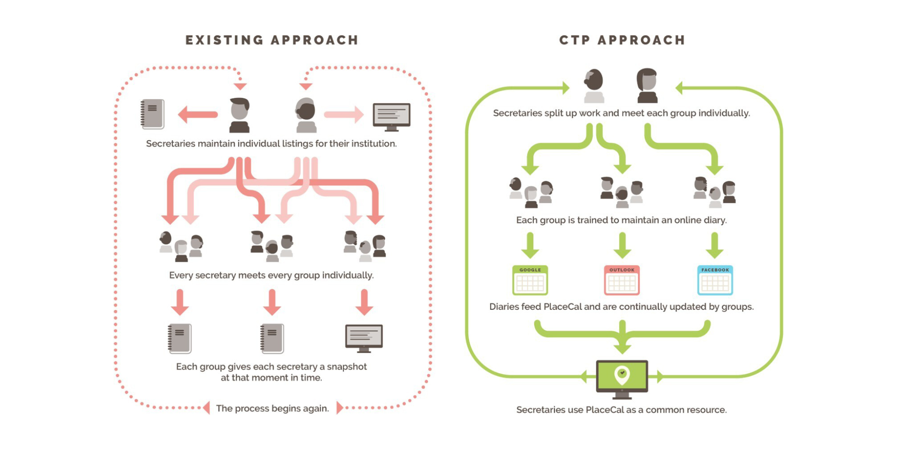
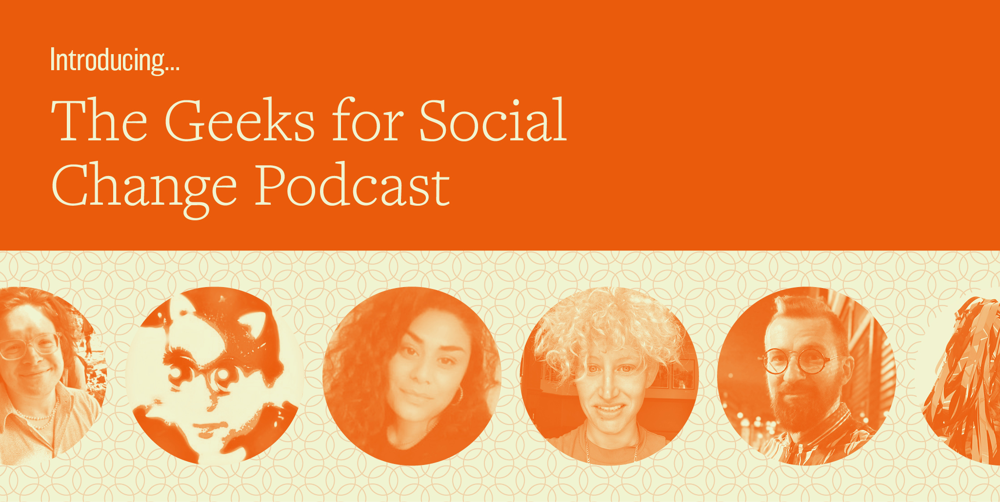

We’ve been really quiet on the social media front the last few months. We’ve expended a lot as a team — from being just Kim in 2020 we now have 11 staff across 2 organisations in various capacities, from half a day a week to our full time 4 day work week, as well as a thriving community on Discord and in the wider world.

We’ve spent a lot of this year reflecting and working out how to standardise what we do, so we can really scale up our big projects and start getting serious about making an impact in the areas we care about.

Like everyone else, we’ve also seen social media go from feeling like something that felt fun and engaging – a place to share photos from nights out and exchange memes – to its true form: a fairly terrifying piece of the military industrial surveillance complex that’s threatening to end life as we know it on Earth. We got pretty bored of what billionaires think and do, so in “relaunching” ourselves on social media are trying to work out how to embed our ethics more in the ways we communicate.

While we develop that methodology (and we welcome your input via [our Discord server](https://discord.gfsc.studio), or maybe follow us on [Mastodon](https://social.gfsc.studio/@gfsc)?), here’s a little roundup of a big addition to our site:

## Publications!

As a studio with our hearts in DIY culture and arts, we do really love a physical thing you can touch and hold. We’ve made a few actual _objects_ over the years and are delighted to announce you can now buy them from our new distribution partner [Pen Fight](https://penfightdistro.com/book-author/gfsc/) (or download a copy for yourself and print at home).

Pen Fight is a feminist and queer shop and small press based in Manchester, UK. Independently run since 2015, they sell zines, radical books, badges, and other DIY and small-run art and craft. We love Pen Fight and are thrilled to have them as a stockist!

### “The Trans Dimension Guide to Inclusive Events” zine and Trans Dimension badges

At the end of last year, we launched [The Trans Dimension](/project/trans-dimension), a collaboration with Gendered Intelligence listing trans events in London. This is entirely automated and built on our PlaceCal technology that we will be relaunching next year. This site is doing really well and has had over 4,000 visitors since then!

Part of this project was to work with trans and disabled people to make a guide to how to make events more inclusive for everyone. Working with **Greater Manchester Coalition of Disabled People** and **Gendered Intelligence** staff and volunteers, we produced this zine that takes you through all the steps of thinking about venue and event access holistically, and gives you a set of prompts to make a comprehensive accessibility statement.

We haven’t been able do as much with this as we would’ve liked, but we’re hoping that (pending future funding) we can run some workshops and work with groups to start getting this knowledge out further into the world.

You can [get a copy of the zine on Pen Fight](https://penfightdistro.com/shop/the-trans-dimension-zine/), [download the PDF from us](/assets/pdf/Trans-Dimension-Guide-To-Inclusive-Events_1.0.pdf), or [read a plain text version](/text/inclusive-events). You can [read more about the zine in our portfolio](/project/guide-to-inclusive-events).

We also had some pin badges made!! These were mostly given away at the launch but we have given a small stock to Pen Fight to sell. Any proceeds from this will go into the project fund.

[Order a badge from Pen Fight](https://penfightdistro.com/shop/the-trans-dimension-pin/)!

### UnTechCon zine

Last December we ran our inaugural UnTechCon event, where we invited people to think about an anti-capitalist tech future. We’re planning on running another one soon, but in all the chaos the first go round forgot to mention that artist and writer [honor ash](https://hnr.fyi) (who now works for GFSC!) made a zine summing up everything we talked about.

You can [buy the zine on Pen Fight](https://penfightdistro.com/shop/untechcon-1-an-untech-unconference-documentation-zine/), [download the PDF directly from us](/assets/pdf/untechcon_web.pdf), or [read a plain text version](/text/untechcon-1). You can also [read more about UnTechCon in our portfolio](/project/untechcon/).

### Resistance Lab “A Growing Threat to Life: Taser Usage by Greater Manchester Police” zine

Back in 2020 we worked with Resistance Lab collective to publish a groundbreaking piece of work with half a dozen local activist organisations, combining local abolitionist organising with high quality research and data science to create a report on the threat posed to life by police with Tasers. This report was a major news story, covered by Channel 4 and ITV Grenada, Vice, The Voice, Manchester Evening News, and The Meteor, among other sources.

Kim found a box in her conservatory. You can [get them (for free!) from Pen Fight](https://penfightdistro.com/shop/a-growing-threat-to-life-taser-usage-by-greater-manchester-police-free-copy/) or [read more about the project in our portfolio](/project/growing-threat-to-life).

### **Making a place for technology in communities: PlaceCal and the capabilities approach**

In this academic paper first published in **Information, Communication & Society** in 2020, Stefan and Kim explore how a ‘capability approach’ to information technology in neighbourhoods with low social capital can create embedded and sustainable [Community Technology Partnerships (CTPs)](/blog/2022/national-network-community-technology-partnerships). These can connect residents and institutions together, reducing barriers to social participation and collaborative action.

The paper also explores the initial implementation and early success and potential of [PlaceCal](/project/placecal), with insight into its potential future, and challenges it may face. It’s been available to [read online](https://www.tandfonline.com/doi/full/10.1080/1369118X.2020.1767173) for a while, but we made a [snazzy new PDF version](/assets/pdf/CTPPaper.pdf) and are [highlighting it in our portfolio](/project/making-a-place) for the first time!

### Podcast page

Finally, we didn’t have anywhere on our website you could see all our podcast episodes! This is now fixed and you can see all the episodes and transcripts from one place. The podcast finally has a home!

We will be relaunching our podcast before the end of the year! [Visit the podcast page in our portfolio](/project/podcast).

## Looking forwards

It’s been great to finally get around to cataloguing and archiving all our past work and this clears the deck for us to work on new things. We have some big plans in motion and would love you to be part of them. If anything here attracted your interest or you’d like to work with GFSC, please do [come say hi on our Discord](https://discord.gfsc.studio), message us on one of our many social media channels, or [drop us an email](mailto:info@gfsc.studio).
