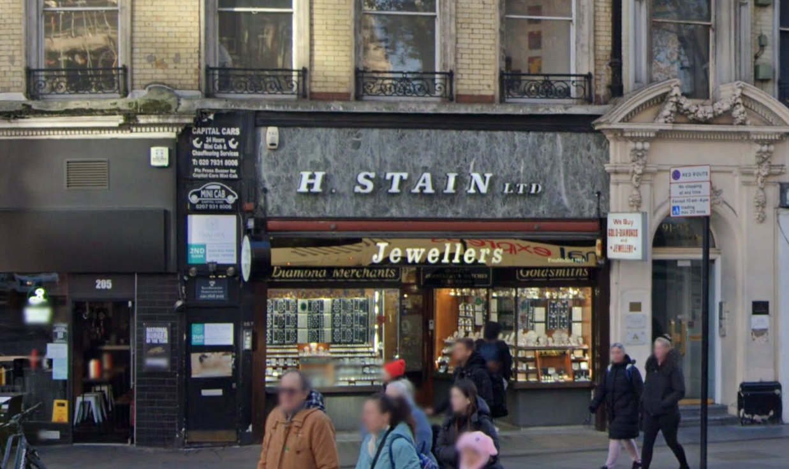
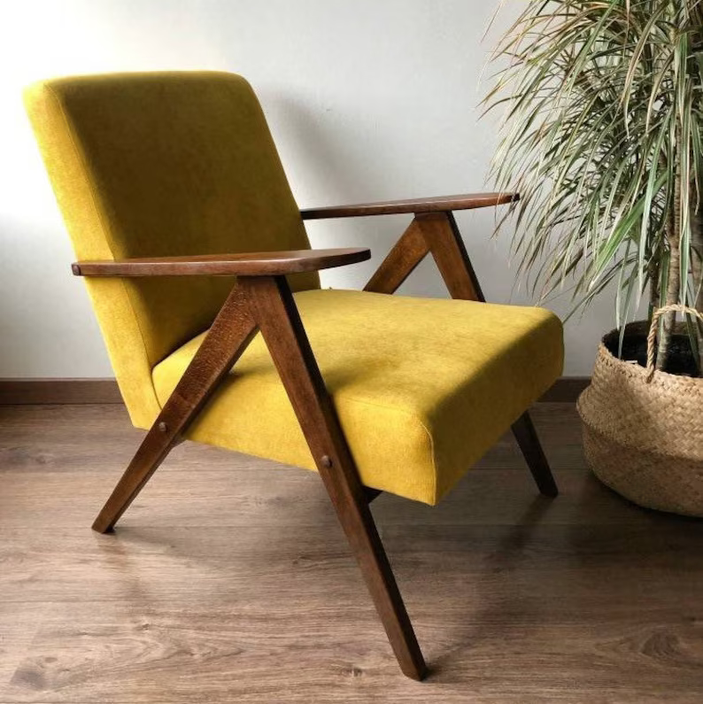
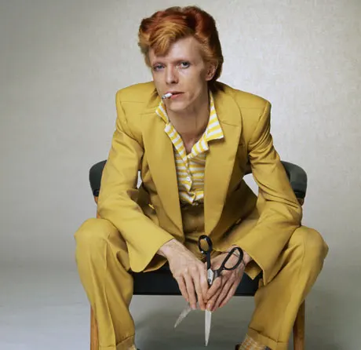



Welcome to the final instalment of this mini series of blogs about our recent local history project undertaken in Oldham. Here’s [part one](https://gfsc.studio/blog/2022/rafft-design-blog/) and [part two,](https://gfsc.studio/blog/2023/raftt-design-blog-2/) plus you can view the final project website at [towersoldham.uk](https://towersoldham.uk/).

To recap in brief, RAFTT stands for ‘Rise and Fall of Two Towers’, which was the project’s initial name. It ended up being titled “The Towers: A history of Summervale and Crossbank”. Summervale House and Crossbank House were two tower blocks of flats built in Oldham in the 1970s. Slated for demolition and replacement with low rise housing which was more needed by the community, GFSC worked with the owners of the Towers, First Choice Homes Oldham (FCHO), to put together a funded project proposal, which was ultimately supported by the Heritage Lottery Fund.

The project’s aims —

1. to collect and document the history of the area, which might otherwise be lost as the towers residents end up scattered far and wide

2. To involve the local community with a specific aim of increasing their digital skills. It was unclear at the start of the project how this might manifest, as it depended to a great extent on the interest and existing digital skills of the community.

Ultimately the project was not very successful in tying parts 1 and 2 together — but First Choice Homes Oldham did begin running some beginners digital skills workshops for local residents which are still ongoing, and will hopefully continue indefinitely.

This blog focuses specifically on the ‘documenting’ aspect, which occurred at the final stage of the project. You can get a deeper look at the challenges we had on the ‘collection’ side of things in [_RAFTT Design Diary #2_](https://gfsc.studio/blog/2023/raftt-design-blog-2/)!

## Structuring the site

In [_RAFTT Design Diary #1_](https://gfsc.studio/blog/2022/rafft-design-blog/) we had already started to consider the underlying structure of our final explorable online archive of content. We asked questions about the narrative flow of the site, and considered what would be the most appropriate interface for people to explore the gathered data. We ruled out ‘Pincushion maps’, mostly because we don’t like them ([see this article by studio founder Kim for more on that](https://cassowaryproject.org/visualising-qualitative-data-on-maps/)) but also because, given the data is concentrated in such a small area, it wouldn’t be relevant for this project.

We did talk about wanting to try and do something a bit more creative than a ‘timeline’, but — hey ho — a timeline is ultimately where we ended up.

The main reason for using a timeline was the comparatively small quantity of content we were able to gather, compared to what we might have hoped. Although the quantity of content was relatively limited, what we had was distributed widely throughout the last century.

We had been hoping to meet a fair number of former Towers residents and build up a rich tapestry of memory about life inside the buildings, spanning their five decades of use. What we actually ended up with was a smaller number of residents, few of whom actually lived inside the Towers themselves, but were instead in the very close surrounding neighbourhoods. A couple of these women had memories of the area reaching all the way back to the 1940s, long before the towers were built or even conceived.

We realised that a timeline structure would offer the best way of visualising the area’s rich history both _before_ and _after_ the towers arrived, and this time-based ‘split’ was something I was keen to emphasise in the design of the site.

We also mentioned in the first design journal that we were excited by the idea of shaping the site around ‘themes’. We have offered theme filtering in the final site, but this is a secondary navigation device, as ultimately the themes which emerged from the stories were a tad less evocative than we might have hoped. For example, ‘Deprivation and Challenges’ wasn’t really something FCHO were keen to go into too much depth on. The themes serve more as a navigational tool (e.g. ‘I want to read a particular person’s stories’, or ‘I only want to read stories about the surrounding estate’) rather than the rich seams of connection we had hoped for.

## Designing the site

Unfortunately, due to scheduling delays caused by the challenges of gathering content, we were much more pressed for time than we would have liked when it came to actually designing and building the site. The lottery had a deadline for when they needed to see a live site, and so we were obligated to work to this.

Despite this end-stage pressure, as a designer I had of course been thinking for some time about some key details of the site.

## Towers and clouds

One of the most exciting design decisions for me was how to differentiate between the ‘before the towers’ and ‘after the towers’ phases. I had a silly idea while falling asleep one night of creating an ‘infinite scroll’ illustration of the Towers, so as you move down the site, you can see these (very tall) versions of the buildings in the background. I wasn’t sure whether to pursue it or not, but, unprompted, one of our dev team told me he’d had the same idea, so I decided to push ahead with it!

It proved surprisingly difficult to create a totally seamless version of the illustration — so don’t look too close, okay 🙂! You’ll see that the Towers appear during the 1970s, when they were actually constructed.

Another ‘silly’ idea which ended up making it to the final site was ‘clouds’ for the images. There was something quite entertaining to me about the phenomenal height of these background towers illustrations, so I figured that the tops of them would almost certainly be sitting up amongst the clouds, right? So I put all the imagery into cloud-shaped cut outs, and ultimately it brought a bit of life and fun to the site, so we decided to stick with it.

## Colours and typeface

I was keen to choose a colour scheme and typeface that felt in keeping with the era the Towers were built. It would have felt somehow disingenuous to make a site that felt too visually cutting edge and contemporary, and I also felt that by using some (currently) less used type styles and colours, it would feel like something a bit different — somehow both nostalgic and fresh.

There’s a particular typeface/type style that sprang to mind for me during an afternoon out on the South Bank — that chunky, bold, outlined all-caps slab serif you often see on building signage from this era (or possibly even before, I found it hard to date — sometime between the 50s and the 70s, I think!)

You can see it here in the Royal Festival Hall signage:

The only other example I could readily bring to mind was this classic old shop signage near Victoria Station (screenshot from Google streetview) — but hopefully you, like me, are familiar with this style, and have seen it pop up on buildings all over the country!

I spent some time attempting to figure out what typeface this was, and with help from the GFSC collective and my own design networks, we established that the closest match was Clarendon URW Bold Oblique.

I have a license to use this typeface to create graphics, but unfortunately it is not cheap or easy to get a web licence. As we try and build our sites to have a long life, and the only options for licensing Clarendon were rolling subscriptions (based on number of page views), we used a flat graphic for the main titles of the site and added alt text for accessibility and SEO. This felt like a bit of a hack, but there was nothing else quite like Clarendon and particularly nothing we could easily license!

For the remainder of the site’s typography I have used Roboto Slab, a classic slab serif which crucially is a Google font, so licensing isn’t an issue!.

In terms of colours, I wanted the palette to feel like it fitted with the Clarendon typeface. For the filters you’ll see I’ve used a similar blue to the Royal Festival Hall, and also pulled in some other slightly ‘dirty’ versions of various brights — to both differentiate clearly between the themes but still feel broadly in keeping with the overall 70s style.

For the main colour of the site, perhaps controversially, I’ve gone with this lovely (?) mustard yellow or ‘baby poo’, as one of our devs less charitably put it 😂. I think this is an under-appreciated hue and one which speaks very strongly to me of municipal buildings, signage, furniture, fashion and more from the 1970s.

_For just £477 you can buy this chair based edition of the site: https://www.etsy.com/uk/listing/698082102/mid-century-mustard-yellow-armchair-b310_

_David Bowie knew what was up https://www.theguardian.com/fashion/2013/mar/12/david-bowie-eight-classic-looks-pictures_

## Accessibility

We are always mindful of accessibility in our site design, and strive to meet at least [AA standards](https://www.w3.org/WAI/WCAG2AA-Conformance) in all areas. This meant a fair bit of tweaking to the theme/filter colours to ensure peak legibility in all contexts.

Another aspect of accessibility which we particularly cared about was clarity of navigation for those who might be new to the internet. Several of our ‘storytellers’ made clear that they had little interest in going online, or that they were daunted by it – which was part of the motivation behind the aforementioned digital skills workshops. We wanted to make sure that were any of these people to visit their local library to get online and visit the site, they would have the best possible chance of using and understanding it.

For some people who are new to the internet functionality that is very much taken for granted (like scrolling) can be new and unknown. It is of course hard to avoid this, but I tried to design the site in such a way that, at its most basic level, little other than scrolling is required from the user.

One common feature of modern websites (particularly ones with similar themes to ours) is a design which focusses on big splashy images, and hiding copy behind clickable pop-ups or drop-downs. One key principle I designed to was to ensure that all copy is visible. As a designer it is easy to be lured in by big, beautiful image montages and fancy effects like parallax scroll and pop-ups, but we have steered clear of all of that here. As well as impacting the accessibility for those who don’t know to click through, sites with a lot of moving parts pose an issue for many people with vestibular dysfunction, who are susceptible to things like migraines or motion sickness.

The site opens with a clear summary of what the project is, and a prompt to simply scroll, as well as mentioning the filters for those who want them. Users who are initially daunted by the filters or do not understand them can ignore that aspect entirely and just view the whole site.

Those who wish to explore using the filters have the option of browsing by either contributor or type of content. For slightly more advanced users, there is a ‘+’ to the top right which, when clicked, offers a handy navigation tool to jump to different decades in the timeline.

My only slight regret is that in order to turn off a filter you have to scroll back up to the top. I wanted a sticky header that stayed with you as you scrolled offering a ‘close’ function, but this caused issues on mobile, so we had to avoid it. This makes the filters slightly less user friendly than I would have liked, but still hopefully on balance a worthwhile feature.

We also realised that we would need to build in some pop-ups specifically for the images on the site. We got some lovely archival photography and old album photos from some of our contributors, and needed to strike the balance between not making the site an _incredibly_ long scroll (by putting all the images directly into the timeline at full size), and not making it too confusing by requiring the user to click too much.

Hopefully the little magnifying glasses in the corner of the clouds make clear to any user that they can view the images bigger, and the lightbox is of a sufficiently simple design that any user would easily be able to close them and return to the main scroll.

One of our devs did reflect to me that modals (pop-ups) like the lightboxes are really complex for screen readers to parse, and as he was considering that aspect of accessibility in the build, it did prove challenging. He said he’d prefer to avoid building them in future if possible, so this is certainly something for me to reflect on when designing future sites. How can we achieve a balanced flow of image and text, and get to the highest possible level of user accessibility?



## Conclusion

Overall this has been a challenging but fascinating project from start to finish. It was the first project I worked on at GFSC, and that is unfortunately a slightly damning indictment of how far behind schedule it ended up falling — I have now been working here for two years!

Most of these issues are due to the challenges we faced gathering content (as documented in [_RAFTT Design Diary #2_](https://gfsc.studio/blog/2023/raftt-design-blog-2/)), which were broadly out of our hands, but reflecting on the process from our end, I think it would have been helpful to start designing earlier. Even though designing without content to work with is challenging, and we didn’t want to define the final shape of the site until we understood everything we were working with, it may still have been better to take that risk and rushed less towards the end.

The site has been built for a long lifespan — the lottery funding is contingent on it remaining live for five years, but we have tried to ensure it will have a life beyond this timeframe, as we do with all static sites we build.

Mostly it has just been a pleasure to get to know this community and its varied history. I would have loved if we could have accessed more of that history, but what we have managed to gather here is far more than would have been secured otherwise. It’s my hope that this site will be stumbled across by many more curious Oldham residents in the years to come.
