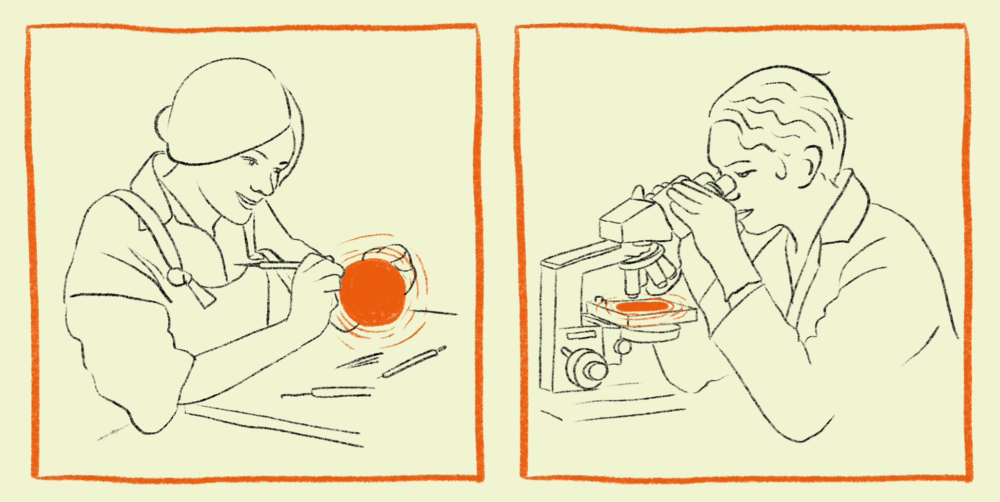

In the process of developing community technologies with our comrades and clients, we’ve identified two distinct ways of working in our teams, both with their benefits but sometimes bringing tension between them. We’ve come to understand these as something like ‘the creative act’ of the craftsperson and ‘the rigorous method’ of the scientist. The former focusses more on the ‘doing’ and the latter on the ‘analysing’, but both contain elements of one another. Both have their place in researching, developing, and delivering websites, software, and other high quality, timely and impactful outcomes – but how do we ensure these two approaches play nicely together in a team?

### The craftsperson

‘Craftspeople’ are skilled individuals who are often used to working on their own. They’ll be looking to apply their experience gained from creating dozens of similar things and to build solutions based predominantly on their own best judgement, rather than looking for external data to back up every decision. 

In our experience 1-2 craftspeople can deliver a small-to-medium sized project (like a simple website or a set of print assets) relatively quickly and to a high quality. Scaling this any higher to a larger team though and things can get difficult and risk a ‘too many cooks’ situation – where everyone on a team has conflicting opinions on how to deliver a project, but all of those opinions are based in real, valuable experience. The work of craftspeople can be of a very high technical and aesthetic quality, but by overlooking the benefits of ongoing data gathering risks embedding assumptions about who the audience is and what they want. It can also be hard for others not involved in the process from the start to pick up a project later to continue developing it – they’re not privy to the factors which led to the craftsperson’s decision-making. 

### The scientist

‘Scientists’, on the other hand, look for data to back up every decision they make. They’ll want to work with external parties (such as users, clients and other organisations) to conduct fieldwork and testing to make sure the right decisions have been made and that what’s been decided is still working. 

Scientists are keen to understand the perspectives of others and get information from those with a stake in the project about how things are working (or not). They’re usually happy to accept that outcomes can (and will) change and are committed to constantly iterating based on regular feedback – feedback which generally starts to be gathered much earlier than a craftsperson would seek it. Projects led by evidence gathering generally take longer to complete than the craftsperson approach, but can have more holistically considered outcomes and more empirical management of each stakeholder’s needs. Making the data on which a decision was based visible to others working on a project enables clearer understandings of why specific decisions have been made. This can generally create a much firmer foundation for doing long term projects with larger teams.

A potential drawback from working in this manner is the lack of a singular, distinctive voice. This can lead to outcomes feeling more flat and risk-averse — a common criticism of ‘design by committee’, which has resulted in many websites looking almost identical and the web being more boring overall. It can also lead to ‘consultation fatigue’ and result in people feeling a bit burdened by the feedback process — with sentiments like “isn’t this your job?”, and the phrase “getting into the weeds” which we do often find ourselves using in this studio!

## Building on shifting sands

Clearly, both approaches have strengths and weaknesses — so how can they work together?

For craftspeople with significant expertise in a field or discipline (and a lot of experience working alone) it can be challenging to work in a larger team with an iterative, scientific approach. While some constraints are good for any creative work, when the requirements and sign-off process for changes start piling up too high it can take all the fun and creativity of design and result in bland and uninspiring outputs. Sometimes the process of feedback will uncover new information which sends the project in a slightly different direction – seemingly undoing decisions made by those with specific expertise which were previously accepted by the team. This can lead to people feeling demotivated to work on the thing they’re the expert at because it can feel like their work and ideas might just be discarded the next day – even if the reason they’re discarded is because new evidence suggests that the project needs to evolve. For someone more used to working as a lone-wolf specialist practitioner, this can start to feel like a waste of time – like trying to build on shifting sands. 

For scientists, a benefit of working in an iterative way is that proposals towards key design choices can be on the table much sooner, authored by a wider range of stakeholders, resulting in more collaborative working across multi-disciplinary teams. By working iteratively, revision, improvement and reframing based on new information is prioritised, rather than being presented with something polished that feels like it’s too precious and coherent to change. This is vital for complex projects with lots of stakeholders whose needs might conflict with each other, as it presents design decisions as negotiations rather than one person just deciding what’s best. Theoretically this approach allows teams to recognise more quickly if things are veering off course due to the continuous feedback, but of course no approach will save you from anything if improperly applied.

Overall it comes down to emphasis. Both methods utilise aspects of expertise and creativity, and both engage with consultancy and iteration – but in different amounts, at different stages of the process. The craftsperson approach can produce good results quickly, but then can be monolithic and hard to adapt later. The scientist approach can ensure all stakeholders feel heard, even if their needs conflict, but can risk being overly time consuming and produce ‘line of best fit’ outputs that make no one *really* happy.



## Is it possible to get the best of both worlds?

We’re always re-evaluating how our processes are working, in order to try and make them the best they can be (for the sake of both our staff and our clients!) The below outlines some ways we’ve identified which can help reconcile the gap between the two styles of working. This is very much a work in progress for us and as always, we welcome feedback.

### Decisions and responsibilities

We have found it important to be super clear at the start of a project where the decision making takes place, identifying who is responsible and who is deciding the structure of the project. This means that everyone involved is on the same page and there can be a ‘point of truth’ to iron out any difficulties which emerge down the line in terms of understanding tasks, timescales, and independent working. 

### What is fixed and what can change?

Having a clear process for defining what is ‘fixed’ and what can still change can really help everyone on the team. This could mean defining sign-off stages, at which everything completed to that point is considered ‘done’ enough to build on and is unlikely to change (unless some really life-changing new information is uncovered). 

### Setting time boundaries

To keep projects in check, we’ve found utility in having boundaries around time budgeting for specific elements of the project which aren’t allowed to change. It can seem harsh, but setting a strict limitation on the hours dedicated to a specific part of the project can help avoid burnout, as well as being an important part of budgeting. It’s freeing to know that ‘I’ve given my input now, and if they need further assistance that’s a fresh negotiation’. It also helps mange client and team expectations on how many revisions and rounds of feedback are feasible. 

### Outlining expectations

Outlining the expectations, limitations and assumptions of the process to everyone involved before the project begins is vital. The clearer things are sooner, the more every individual contributor is able to understand where their work and their expertise fits in to the broader project plan. 

### Explaining ‘why?’

By underlining the importance of direct user feedback, it’s more likely that everyone will be on the same page and any feelings of frustration at being ‘held back’ or having to repeat and revise work can be ameliorated by an understanding of the benefit to the final product through the insights gained through thorough user testing. 

## Our approach

At GFSC, we know that clients approach us both because they admire the rigour of our research, and the aesthetic and technical quality of our final outcomes. We are still a relatively young studio and are constantly learning about how to strike the balance between these two qualities in our work, and finding ways to let both the scientists and craftspeople in our team thrive, and produce their best work, in partnership. 

We know that it’s not simple to divide people into two ‘camps’, and that in different contexts people might display different tendencies. This post isn’t intending to create a new strict dichotomy to organise around — merely to highlight two ways of working which we’ve found can sometimes cause conflict, even though both of them bring important and valuable insights to the research, design, and development process. 

It’s our hope that by talking about these challenges, we can inspire open and honest reflection and communication about how to work together more equitably going forwards, and move towards a better world for everyone (where things *actually get done*!)