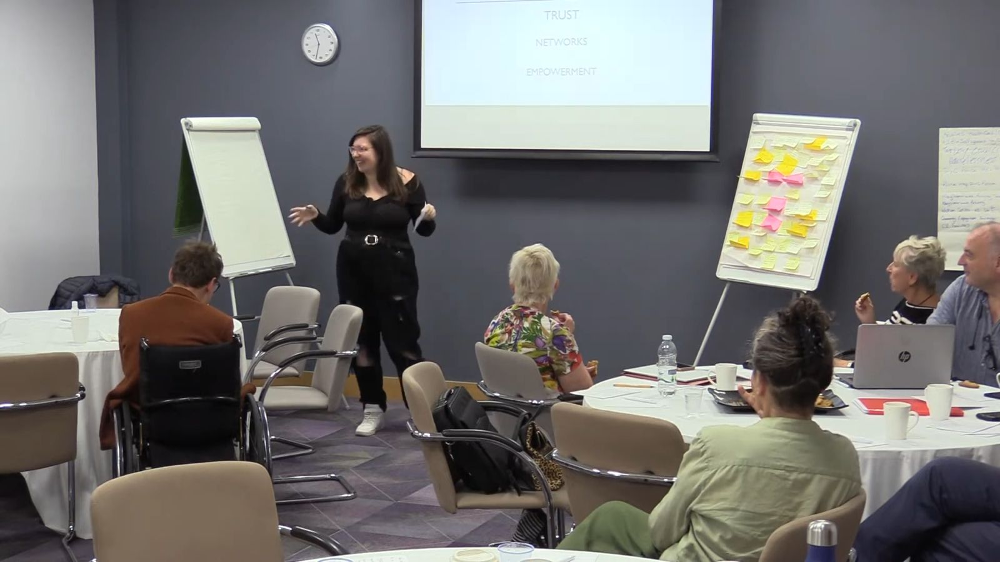
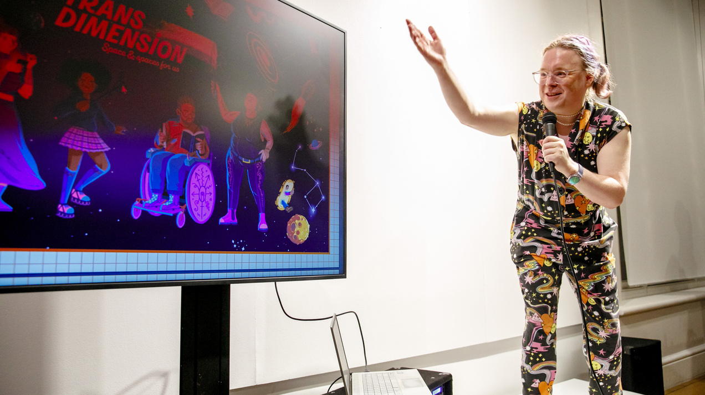
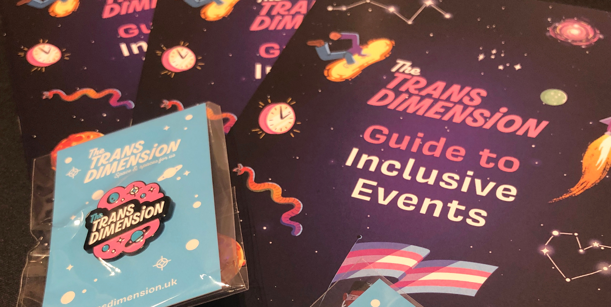
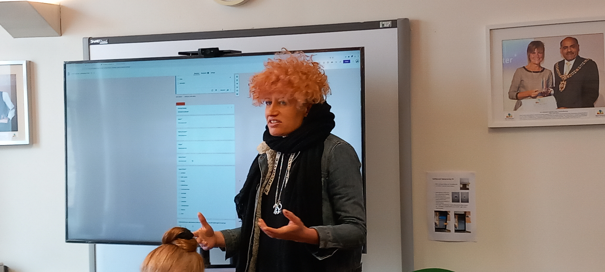

# What is a CTP?

Community Technology Partnerships (CTPs) are a concept we’ve been developing [since 2016](https://gfsc.studio/blog/2017/tech-culture-failing-communities/), with [a journal paper on the approach published in 2020](https://gfsc.studio/project/making-a-place/) and our first [official funding happening in 2022](https://gfsc.studio/blog/2022/national-network-community-technology-partnerships/) thanks to the National Lottery Community Fund. Since then we’ve been working hard on refining and exploring CTPs  and our flagship tool PlaceCal in order to help connect communities without needing to rely on walled-gardens and big tech. 

What have we learnt about CTPs in this first year? The rest of this post is a selection of some of the “best bits” of our first year report. We will be sharing the rest of our findings in the coming months and years!

> Disadvantaged communities and their people are not the problem – they are the solution 

*Hazel Stuteley OBE, Chair C2 National Charity*

This quote informed the outcome of our first year in ways we could not have anticipated. The overarching narrative of our first year is one of shifting priorities and rescoping our activities due to the ongoing impact of Covid-19, and the the large scale removal of state support by the Conservative government. Illness, cost of living challenges, the climate crisis, and complete burnout across the sector has had a huge impact on both our abilities and the communities we work with.

We thought we’d be working mostly to set up partnerships and launch the CTP approach with our network of collaborators. However we were told pretty quickly by basically everyone that actually they’d just like us to use the tool we keep going on about — PlaceCal. There is a big sense at the moment that people are tired of more approaches and initiatives and just want simple technology that works for them right now.

In our case, the overwhelming demand is for a community information source and events calendar that honestly just works the way [Facebook Events used to](https://gfsc.studio/blog/2022/rise-fall-facebook-events/): but easy, free and shaped to fit their needs rather than serving corporate interest. Following this thread, we shifted course to focus more intently on making PlaceCal the tool it needs to be to meet communities needs, and even secured an extension to our funding to reflect the cost of living challenges – but where does this leave CTPs? 

---

Perhaps the single biggest refrain heard when doing community work with tech today is some variation of:

> …But I’m not a tech person!

*Everyone*

Empirically however, almost everyone we interact with uses one or more computers to do some or all of their job with, and if they didn’t, they would be incapable of doing that job. So how did we get to the point where we have more computers than ever, but people feel less empowered to say that they feel able to operate them? 

Our Growing Great Ideas project aims to interrogate this disempowerment and begin the work of building digitally autonomous communities. 

In developing PlaceCal, we are working to create a digital commons of high quality, accurate, and trusted information about community activity and events. It will be owned, curated and operated by a real world network of community organisers.

We want everyone to live in a neighbourhood where it’s simple to organise community events and bring people together. It should be easy to start a new group and have people find out about it. It should be simpler to put on and promote events. We want people to be able to easily work with others in their area to do things they can’t do on their own.

PlaceCal is being co-created by the project partners (i.e. existing groups in real world communities), and aims for four levels of impact:

- **Grassroots** (aka soil, roots and compost)**:** Work done by activists / organisers to facilitate things based on place or interest (Partners)
- **Niche:** Local partnerships and groups who cooperate together in similar places on similar interests (existing partnerships and CTPs)
- **Regime:** Our “network of networks: the work of the project is “community organising organising”, creating connections between and across this network and finding places we can create outcomes that benefit everyone.
- **Landscape:** The laws, policies and framework that structure people’s day-to-day life. Our redefined concept for Community Technology Partnerships (CTPs), and the framework on which PlaceCal is built,  is based on the UN/WHO-backed Capability Approach. [The concept takes a non-representative, directly hands-on approach](https://www.tandfonline.com/doi/full/10.1080/1369118X.2020.1767173) to overcoming people’s problems with technology, as an alternative to ideas like digital inclusion and design thinking which in our view are failing the communities we work with.

We focused year one at two specific intersections:

- **Grassroots → Niche:** how do individuals grassroots groups help coordinate more organised local partnerships, or niches?
- **Niche → Regime:** How do we help this “network of networks” work together? (i.e. how do these niche partnerships form a regime coordinated by our initiative?)

These levels of concern were given to us by our lottery funders but we found them really helpful to think about the different ways of thinking about communities and is based on [Geels’ theory of technological transitions](https://pure.manchester.ac.uk/ws/files/29255286/POST-PEER-REVIEW-PUBLISHERS.PDF).

## We are developing ways to create tech outcomes from community needs

We are currently completing our methodology for converting community needs to tech outcomes. This involves working with individual community groups and partnership organisers, and thinking about the shape and structure of our own team.

Fundamentally our goal is to be able to convert a simply expressed community need into one or more tech[^1] outcomes. These needs include situations like:

- “I want to put on a social coffee morning for older people and have everyone know about it”
- “I want to get all the people doing yoga in my neighbourhood together”
- “I want to start a new drum’n’bass night and am not sure how to do it”

Anyone aiming to do these things will face many barriers. These might be things like:

- Access to space: knowing where there is a space you can hire, knowing who to talk to, having experience with managing contracts and expectations around venue hire.
- Social: knowing who to talk to, who already puts on events like this, having the social skills to host a group, being able to access other volunteers to help you run it.
- Financial: being able to afford hire fees and startup costs, having your own time covered to do the work, being able to organise events because your financial needs are met.
- Technical: getting the event online, promoting it to other people, managing expenses, getting people’s contact info for future events, managing booking forms and ticketing.

The *kinds* of barriers are pretty consistent across many settings, but the specifics faced in overcoming them by any individual are unique to their personal situation and neighbourhood. This is commonly reflected in the overall feeling that certain neighbourhoods have a lot going on and others don’t and there’s ‘nothing to do’.

If there are only a few barriers to organising and it’s a well-trodden path with lots of support and infrastructure, then people are far more likely to figure out how to overcome their challenges . But if they can see dozens of barriers, and there’s no support easily discoverable, community organising can look completely out of reach.

People go to their friends, relatives and trusted community organisers for help and support with promoting their events. This is why it is no coincidence that we ended up with two part-time venue managers as our community development organisers: in their interviews they were far more qualified to take on this role than ‘tech people’ who might have organised the odd code meet-up.

The tech and social aspects of promoting local events and activities are heavily intertwined, however. For example, choice of social media promotion can be very context dependent, and may only be known by people in a given area. There might be key WhatsApp or Facebook groups that people can access, Instagram aggregation accounts, or local info portals with a big audience, and you wouldn’t know about these if someone didn’t point you in the right direction.

This means that some blockers can be very difficult to untangle. Someone wanting to organise a home education network (one of our collaborators is doing this in Calderdale), is simultaneously figuring out their *own* tech and social expertise limitations, as well as the tech and social expertise limitations of their *whole network*. Capability is communal as well as personal.

To put it simply: **it has emerged that there is no meaningful dividing line between what is experienced as a social problem and what is experienced as a technical one.** This is a sticking point that has taken a lot of work to unpick, both for our own team, and the people we are working directly and indirectly with.

[^1]:Our definition of ‘technology’ is expansive and based on the etymology which means ‘systemic treatment of an art or craft’. Technology is the *systemising* of desirable processes, which often *involves* tools, but our emphasis is on the systemising itself. This means that we see training, documentation, apps, websites, group constitutions, and well designed posters all as ‘technologies’. For more on this outlook we recommend Ursula Franklins’ *[Real World of Technology](https://archive.org/details/the-real-world-of-technology/) (1989)* lecture series.

## We are understanding the underlying problems stopping people bringing groups together to form partnerships

The main focus for year one has been understanding what kinds of people have both the will and the means to establish community partnerships — “groups of groups” working together. There are several kinds we have encountered:

- **Institutions** such as city councils, housing associations, and the NHS wanting to work locally with community groups. These organisations often had the stated intent to do so, but neither a plan to pay anyone externally do do this work, nor the internal will (or staff) to push this work forward. Their main focus tended to be intelligence gathering work to make private resources for their own employees, rather than investing in the public good. We have abandoned working with these groups for the time being.
- **Individual ‘local’ community organisers,** the people ‘everyone knows’. These people have typically been active for a long time and are usually doing lots of ‘behind the scenes’ work. We found these groups run by these individuals have the will to succeed, and already put in the work and cultivate the relationships, but don’t have any resources of their own to ‘spend’ outside their own time, and are often unsupported by local institutions.
- **Communities of interest,** such as around hobbies or small businesses. These range from a 500-strong women’s social enterprise network to six people with their own holistic healing groups. These are the types of groups we have spent most of our time working with.
- We also found an ‘anti-example’: **funder communities**. Where big funders have established communities around their funding (often called ‘communities of practice’ or ‘participatory grant making’) these are often vastly unequal power relationships where the people in them use very different language to describe their membership and affiliation than the funder does. While everyone is generally mutually happy to be in this relationship, we’ve found that they’re not a meaningful basis to do further unpaid community organising work on top of, as they do not have strong roots or a reason to exist beyond the funder itself.

We are therefore focussing our work on community organisers of interest and place, to understand their barriers as they try and get all the groups in their network working together. Our primary outcome for this is that they have a ‘curated calendar’ in PlaceCal: https://placecal.org/find-placecal.

## We are helping individual community groups overcome their barriers to having a web presence

Our team’s first goal with each individual community group (partner) is to help them get a tech setup that works for them. This usually involves helping them to adapt what they already have, or sometimes adding something new. During this process, we regularly encounter questions about getting information shared online. 

People sometimes want help with an events-specific web presence (like Eventbrite, Meetup, or Dice), sometimes with social media accounts, or they may simply want an online internal management tool like Google Calendar, Airtable or other services. They may want help with their existing website on Wordpress, Squarespace or Wix that they don’t know how to edit or the volunteer doing it has gone missing or left the organisation.

Given that having an online calendar of some kind is a requirement for getting events added to PlaceCal, undertaking 1:1 support and tutorials with groups to overcome these direct pain points they are already experiencing has been a vital part of our work. We have been able to help groups identify more clearly what their needs are, what tech solution would best fit their ways of working and requirements, and get them set up with that solution. As our work in getting partnerships inevitably involves repeat visits and ongoing communications, we have also been able to help troubleshoot ongoing issues along the way. 

One of our key learnings during this project is that this kind of ‘hands on’, low-level tech support is vital. Even though setting up a Google Calendar (for example) is often a relatively simple task within the technical skill of the people we work with, it’s making a decision to join a wider network and taking that first step to do it that can be daunting. It takes a lot of trust and faith in the person asking you to do it. This is one of the areas in which our team have offered the most value to the partners that we have directly interacted with. We have also found that a lot of people don’t realise the full functionality of the calendar services that they are using — for example, that you can update an event’s details on your phone, and then these will update everywhere online,  or that it is possible to publish an iCal feed from Outlook. Realising how simple and powerful these tools are to use has been a real gamechanger for many groups especially as it’s working with technology already used and paid for by groups that people already look at every day. 

> This has been vital in building connections with groups as I found many people had the *skillset* to make a Google Calendar, they just didn’t have the *confidence,* and had reached tech burnout over lock down.

Providing a space where people could ‘have a go’, ask ‘silly’ questions, and do it together, showed people they were more tech savvy then they thought.

*Rachele’s PlaceCal diary*

## We are building the evaluation and training tools to manage all this

We have created a theory of change and project plan. These are now guiding us on the resolution of the project.

We are currently working on ironing out our evaluation and training methods and the stages findings go through from discovery to resolution. Once complete, we will have data stored in a consistent manner across the whole project.

We will be sharing our theory of change and fieldwork data when we’ve tidied it up — watch this space!



# Our first year of CTPs

## The first year in numbers (May ‘22 — April ‘23)

- 86 partner sign-ups
- 4 x live PlaceCals: The Trans Dimension, PlaceCal Manchester, PlaceCal Torbay, and Greater Manchester Systems Changers (GMSC)
- 6 x PlaceCals we are actively working to set up: PlaceCal Norwich, PlaceCal Oldham, Conscious Collective, Climate Justice (Tipping Point), Home Education, Women’s Social Enterprise Network (Flourish CIC)
- 5 x dormant sites waiting for us to add key features
- 50+ enquiries to work through when we’re ready from a wide range of community groups and institutions throughout England and Wales
- 6 x tech workshops for partners with nearly 100 attendees

## The first six months: setting up our infrastructure

From the outset, we knew we had to recruit a team on on the ground to work directly with communities, listen to their challenges, and help them figure out how to dismantle their specific barriers.

A project manager was recruited to administer the delivery (David, based in Manchester), and two Community Digital Organisers: Rachele (North England, based in Manchester), and Coral (South England, based in Torbay). 

Both Coral and Rachele were initially tasked with setting up the first CTP in their region.

Rachele, who runs a thriving community pub in Hulme, Manchester, was tasked with creating a PlaceCal partnership with the Greater Manchester Systems Changers (GMSC), which was comprised of around 30 grassroots organisations funded by Lankelly Chase. As mentioned earlier, pursuing a partnership comprised of organisations united by a common donor rather than shared purpose or existing relationships meant Rachele struggled to make meaningful connections.

> I initially found it hard to engage with GMSC — I met most people at the event, and got numbers and emails from GMSC… but the details seemed to be out of date. I cold-called, attended GMSC events, sent emails and didn’t have much luck.

*Rachele’s PlaceCal diary*

Coral is based on Torbay, where she runs a board game cafe shop, and is deeply embedded in the local community. She attended C2’s three-day “Residential Experiential Learning Course”, convened by C2’s cofounder Hazel Stutely OBE, in September. She delivered a presentation on PlaceCal and CTPs to the C2 network. Coral then worked hard to establish a thriving PlaceCal in Torbay, getting 18 groups and dozens of events on board in short order.

*Coral doing a presentation on PlaceCal to C2 at their weekend gathering*

We also set up a steering committee made of representatives from C2, Lankelly Chase, Gendered Intelligence, Geeks for Social Change and Radical Routes. However, after a series of enthusiastic initial meetings, attendance began to drop off as the sector became increasingly embattled and meetings were eventually halted.

The impact of this sector-wide withdrawal was felt most keenly for us when one of our most important partners in our initial Lottery bid — C2 — became dormant, and could no longer support us with their guidance or infrastructure. Without the capacity to recruit new partners through C2, Coral was forced to limit her efforts to Torbay and, six months into the project, had to resign her position entirely, due to an inability to access appropriate childcare.

In October, Kim and Rachele [did a podcast](https://podcasters.spotify.com/pod/show/gfscstudio/episodes/The-Rise-and-Fall-of-Facebook-Events-e1onssn) called “The Rise and Fall of Facebook Events” on the issues we’d faced already, and their own experiences as organisers. This podcast led to an invitation from the NHS’s Public Participation team to [present a talk](https://gfsc.studio/blog/2023/everything-we-want-to-tell-you/) at the Start With People event in March 2023.

In November, we launched [The Trans Dimension](https://transdimension.uk) in collaboration with Gendered Intelligence, our first ‘white label’ PlaceCal site. The development budget for came from another funder (Comic Relief and Paul Hamlyn’s Tech for Good fund), and we were able to use all our learning and code base improvements from the National Lottery funding to make it even better. There is more information on this [on our website portfolio](https://gfsc.studio/project/trans-dimension/). A poll of people following Gendered Intelligence on Twitter (i.e. an already heavily engaged group) found that the median number of trans groups people knew about in London was 3 — our project found over 45 active groups that are now actively working in partnership together publishing dozens of events per week. This site is a huge success with 6.7k visitors since launch and continues to get hundreds of visitors a week despite almost no extra effort being expended.

*Kim launching The Trans Dimension at Queer Britain in King’s Cross*

*Jay from Gendered Intelligence opening the event*

We also developed The Trans Dimension Guide to Inclusive Events, a mini-zine on how to make events more trans and disabled inclusive. We did this based on workshops with Greater Manchester Coalition of Disabled People and Gendered Intelligence staff and volunteers.

*Zines and badges produced for The Trans Dimension launch*

Back in Manchester, Rachele discovered there was a desire to engage with our approach — but capacity was extremely limited and there were significant barriers to unpick and address.

> I found many groups had switched to WhatsApp groups — these worked short term but fell apart when there were too many members. People did not know what to use instead.
>
>Rising costs meant that many spaces were having to charge venue hire — this meant some groups had stopped.
>
>People did not want to engage with digital skills after COVID — tired of Zoom etc.
>
>Frustration with Platforms — eg Twitter! Nothing connects locally anymore — apart from some specific FB groups. People get burnt out by WhatsApp groups.
>
>People did not have capacity to engage with PlaceCal — some organisations I contacted said that it did not fall into anyone's role and they were only paid to do specific projects.
>
>There is real burn out and “what is the point?”

*Rachele’s PlaceCal diary*

## The next six months: grassroots development

> I went to as many panels and sessions where I could present about PlaceCal. I especially worked with Flourish CIC, as their group represents over 500 social enterprises and community-led groups across the North West.
>
>Out of this research, I came up with [bespoke training] sessions. Most beneficial was working with Flourish’s network — we did informal sessions to develop the Digital Skills workshop based on what they felt they needed. I was really pleased as it was well received - each session had over 20 people sign up, and at least 10 people attend and all attendees really felt like they got something out of it.

*Rachele’s PlaceCal diary* 

*Rachele demonstrating how to use a Google Form for event registrations*

Rachele also delivered [sessions like this](https://www.eventbrite.co.uk/e/digital-skills-for-social-changemakers-in-greater-manchester-tickets-527466134407) with a number of other groups. 

In addition to identifying the broad need for up-skilling, Rachele’s on-the-ground research confirmed that in order for PlaceCal to gain traction, we needed to engage community organisers who had already built up partnerships of groups. Our starting assumption that we could build a platform from the bottom-up was complicated, as Rachele discovered individual organisers wanted a PlaceCal that was grounded in communities of interest, and could be run by one or two highly motivated individuals, rather than many partners tending their individual calendar. 

> [We] found “curators” —  individuals who maintain a group or collect and share events around a specific interest. These are the people that PlaceCal needs to engage with. These people have the connections and trust needed, and normally have the level of tech confidence to engage with PlaceCal straight away. Most have been maintaining a calendar of some sorts. Alongside this, they understand the wider benefits of PlaceCal.
>
>Examples:
>- We found a lady who had collated all the children’s events in Google Calendar.
>- There is a lovely man who collates all the up-to-date food bank information in Google Docs.
>- Hayley works to connect up Home Education events and has access to Facebook groups and runs some spreadsheets.

*Rachele’s PlaceCal diary*

The latter half of the year was spent creating a focused plan to execute the changes and improvements being fed back to us from the grassroots level. 

This necessitated an increase in project management requirement and a reallocation of budget to fund essential tech development through our tech subcontractor, Geeks for Social Change (GFSC). We changed our development focus to work on PlaceCal features for our grassroots partners and niche partnerships.

We started really discovering and digging into the confusion and discomfort about ‘who does what’ in our team. Structural change is complex and so is the software that underpins PlaceCal. It isn’t just community development work with a bit of tech. 

We started to ask questions like ‘How can people like Rach and David meaningfully interact with designing a product when their background is wholeheartedly in community development and not software development?’. This has been extremely difficult work for all of us but in working this through we’ve discovered a lot of fundamental issues with developing software with not for communities that we could not have discovered any other way.

At the end of year one, we were at a pivotal moment in the project. We had suffered numerous setbacks and had our assumptions challenged in many different ways. We felt it was time to document and disseminate our learning in a way that fully explored the complexities we had encountered. This was the genesis of our Theory of Change, and building on that groundwork to draw up a complete project plan for the rest of the project. 

# What have you learnt?

We have learned an enormous amount during this process about our approach, the conditions we are facing, and what we need to do to overcome this together.

## We need to retarget PlaceCal at Organisers, as they are the key to engaging with grassroots communities — but they are struggling

Our previous assumption was that city-wide institutions like councils, housing associations and the NHS would be the ones supporting us in a rollout. We learnt this was not the case on the ground and that we instead needed to work with active community organisers. 

Practically, the biggest difference this made was shifting our attention to communities of *interest* over communities of *place*. Our initial work assumed that community of place would be the biggest pull, with PlaceCal being based around the idea that individual organisers would step up to manage ward-level sites. In practice, the divide between community and interest is less concrete than we’d originally imagined. For example, trans people (an interest-based group) who live in London don’t really care about trans groups in Germany. Meanwhile, over 80s in Hulme (a place-based group) probably don’t care too much about drum and bass nights there (not without exception, of course!).

We also found that institutions (e.g. councils, the NHS) work very strictly according to ward boundaries and continue to move with them if they change. Communities of interest (e.g. trans events, yoga and bodywork) tend to operate over much wider areas, but with a much narrower focus, and they care less about which specific area they are in.

By shifting our focus to these networks we found people who were much more motivated to curate their network of groups, as this is something they were trying to do already — unlike the hyperlocal ward-level sites, which people didn’t have the same affinity towards. Even where there were some ward-level projects, they often didn’t define as the ward per se but some smaller subsection of it, e.g. ‘West Street’ — one area of one postcode in Oldham, or ‘Age Friendly Hulme and Moss Side’. 

This shift has been profound. We discovered that to attract these groups we needed to give more of a combined package of support and encouragement to get their partnership working together. Most of all, people want a lot more visual, layout and functionality personalisation than PlaceCal is currently able to offer. 

We are now working to improve these options, and are confident that enabling this relatively small but very motivated group of people is key to the success of our whole project.

## Community digital tech overall is in a much worse case now than when we started — and we need to adjust expectations

This has been an extremely difficult few years for everyone we are working with.

In some ways this is an opportunity for us as an initiative. We are potentially a big source of hope and lots of people want the opportunity to work better together but don’t have the tools or skills to do so.

In practice though, this has meant that we have had a lot to learn about the specific differences between each community group’s exact needs. This has reinforced our approach of using known community organisers as the key people to lead this work. But it also means we need to meet people where they are, and deal with their immediate tech needs, before we can interest them in any further coordination or development work.

> One of my strengths as a community leader is I know how much people get hassled by consultants with no real gain except for taking up their time.
>
>I have offered people my skills in return for meeting with me - anything from helping with funding bids to cleaning! This is invaluable as many of these groups run on volunteers / goodwill so people's time is precious.

*Rachele’s PlaceCal diary*

## Partners are struggling to make something suitable for their needs and need a lot of support before we can onboard them

Despite the supposed huge advances in tech, individual organisers are struggling more than ever to list events and services online in ways that can be easily discovered. Even staff on the project are struggling to find suitable and affordable ticketing and website solutions for their venues. Often people are stuck with relying on ‘the tech person’ (who no one has seen for six months) to provide and/or maintain a website, and there is no community culture around doing this in ways that are not effectively gate-kept by a tech volunteer. 

> I can’t do anything without getting hold of Solomon who runs our website. I don’t even go on the website! I need a new website! I want to know how it works, how can access it.

*Local youth group leader*
> 

The primary way we are helping these local organisers is by working with them to understand and overcome the barriers they are facing to having and maintaining a web presence. We are doing this by direct hands on qualitative research with groups in each area, which is being collated into a database of barriers and solutions.

> I explained how PlaceCal came about, how it could benefit the community, how simple it was… I also offered to come down and see the work they do and offer any support. I think this made a huge difference — the offer to sit next to her and set it up. I feel like lots of people I have connected with want the chance to be heard, to air their grievances and frustrations.

*Rachele’s PlaceCal diary*
> 

## It’s really hard to know where to apply effort best

A lot of times it’s really unclear where the problem lies with any given tech requirement.

For example, one community centre wanted a website for their organisation. They have really struggled to get a website up and are now using something with Wordpress. This is fed by a Google Calendar feed that also goes to PlaceCal. So on paper they already ‘have a website’ and ‘publish events online’.

However, results on PlaceCal and their site now show a lot of events that just say “empty slot”, and the calendar is incomplete and really hard to read. From our end this makes it really hard to know what’s wrong. Is this a problem with the base feed they’re sending us? Is this a problem on their website too? Should we write a filter to let people screen certain words from their import process? Or do we just say this is out of scope for us to fix and demand a base level of event information integrity before adding to our site in the first place?

Another example is the network of home education groups. These groups are attempting to create a national network of people doing this work, but had no computer systems to do this with properly, so the project was unmanageable. We’ve now worked with them to create a database in AirTable that meets their needs: but is this something that’s sustainable to do for everyone? Are we just making more problems as we go?

Overall it’s really hard to know where to draw the line when helping people out, and where our interventions end up becoming the next problem for the group to deal with when we are out the picture.

## No one really has a model for how this should work

The current state of community data gathering, storage and retrieval is a complete mess. Almost everyone we worked with is, in our view, acting in breech of GDPR and data protection law almost all the time. We hear horror stories of residents who help out at a local food bank having their phone number put on flyers and circulated by institutions without their knowledge or consent. The ‘mass cc’ strategy to group organisation is still the main tool in use, resulting in many people ending up perpetually on mass mailings they can never ‘unsubscribe’ from. 

The reverse is true too: willing and able community organisers who would like to be involved in local activity can never get their names *onto* these lists as there is no real acknowledgement they even exist, and most community events start from a semi-arbitrary list of all the emails the person convening thought of when they started. 

This creates a culture of complex gatekeeping. Institutional organisers limit wider community involvement to people they personally approve of, so you can be added to lists against your consent to begin with, but also quietly dropped from distribution when you upset the wrong council officer.

Try and talk to anyone about these very real legal and social barriers around fundamental needs and they’ll probably pull a face or act as if you’re asking for the moon on a stick — which maybe you are. But given the millions spent on digital inclusion, the complete reliance on computer systems to do people’s day-to-day jobs, and the half dozen community development officers in any given neighbourhood, it is astonishing that even this basic most low hanging fruit doesn’t have a satisfactory resolution.

Computer databases have four basic activities: create, read, update and delete (aka CRUD). These are very simple to code and extremely difficult to create social structures for. We are learning that we need to have more and more detailed conversions about these rights on a  neighbourhood level as a prerequisite for further development. 

- Create: almost every community group starts from this, creating contact lists or posters and online listings for events.
- Read: currently you can only find out about things easily that you directly subscribe to (i.e. follow on Facebook or Instagram), or via a physical poster in a venue. In other words, there is no online organic discovery mechanism for hyperlocal activity.
- Update: when things go out of date or need correcting, there is often no easy way to correct this info. E-flyers can’t be retrospectively fixed, posters need editing manually, etc. Online event listings can do this — assuming people have booked a ticket using a login and you can send them updated information. However, given that the majority of community activity is unticketed, this doesn’t actually happen much. Distribution lists are similarly complex in practice, and make it difficult to update contact info without great manual effort and multiple requests.
- Delete: it is basically impossible to have your email and sometimes phone number removed from the public domain once in it, even using legal recourse to GDPR complaints.

A key benefit of PlaceCal is that it works as much as possible to give people the most direct and simple access to all of these actions without giving away their personal information. But we are learning we need to do much more work to help people understand the CRUD functions and their importance. Right now, across any given community, the way information storage and retrieval works is — in our view — dysfunctional, illegal, and immoral.

## We need to develop organisational structures that are more fit for purpose

Our committee meetings were another casualty of Covid and sector burnout but they taught us that there are strategies around planning and administration we can incorporate to improve their efficacy when we restart them after PlaceCal is launched.

We are working on the following concrete outcomes:

- Explicitly developing a new way of working between tech and community, something that we are already starting to discuss on our social media and in person.
- Designing a company structure that manages to thread the needle and balance the needs of communities using our software, developers, community development workers, funders, investors, and charities.
- Solidifying and disseminating how we use organisational tools. We have set up a large range of support tools to track all our internal conversations and interventions, including WhatsApp, Discord, GitHub, Trello, Notion and Chatwoot. Our next step is to create a diagram for how this all works as a whole. This is a large, complicated piece of mutual understanding across multiple domains and types of expertise. We are hopeful we have now made serious inroads into this and can publish a formal process for this in the coming year.

# What’s next?

As you can probably tell, this is just the start and we are currently laying the groundwork for what’s to come. GFSCs current overall mission is “to work in partnership with people and organisations who share our social change goals to create tools and processes that help us live joyful, connected and capable lives in communities free from oppression”. And we think we are getting closer than ever to making this a reality for everyone.

Please do get in touch if you want to have a chat about our approach. We are especially looking for other philanthropic funders and charities who may feel they’ve funded a lot of tech work that hasn’t really added up to much (perhaps under the “digital inclusion” or “human centered design” banner), or that all the tech work they do seems to never quite integrate with the rest of the organisation. We think you’ll find what we are doing a refreshing approach that compliments ABCD or strengths based approaches perfectly, and doesn’t require separate “digital” processes.

You can also join our [community Discord,](http://discord.gfsc.studio) or subscribe to our email for updates below.

Thanks for reading!